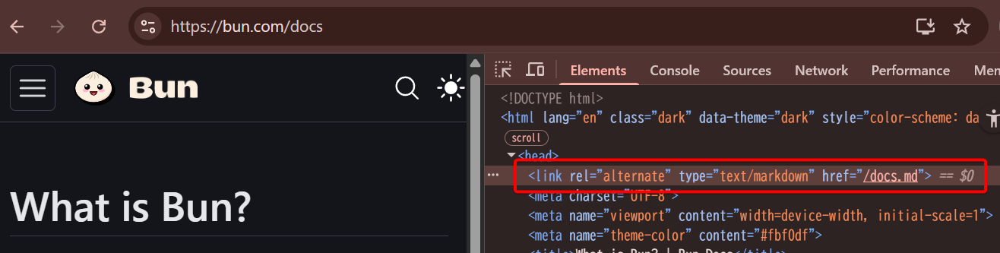
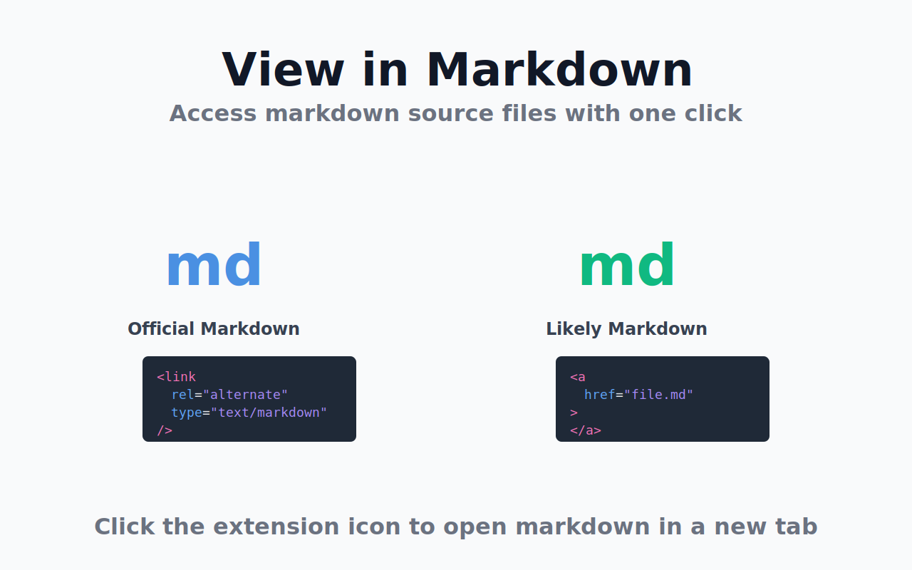
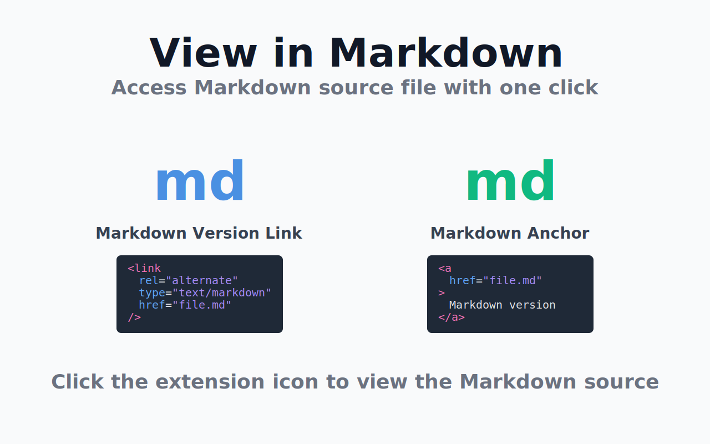

### 動機
**UPDATE** (2025-10-25): この拡張機能が公開された翌日 (2025/10/22) に Bun の Web サイトが更新され ([X](https://x.com/bunjavascript/status/1980796044851245347))、 `<link rel="alternate" type="text/markdown">` のタグが削除された結果、 Bun のドキュメントで View in Markdown 拡張が機能しない状態となっています。

[bun.com/docs](https://bun.com/docs) のようないくつかの Web サイトで、 `<link rel="alternate" type="text/markdown" href="/foo.md">` の形のタグを用いて Markdown 版のページの存在を案内しています。

<figure>
  
  <figcaption>bun.com/docs で <code>&lt;link rel="alternate" type="text/markdown"&gt;</code> が使用されている例</figcaption>
</figure>

LLM の普及により Markdown 版のドキュメントを利用する機会が増えています。そこで、Web ページが `<link>` タグで提供するメタデータを利用し、 Markdown 版ドキュメントに素早くアクセスできるようにするため、 [View in Markdown](https://chromewebstore.google.com/detail/nklegbonbkblciabbopknmnjbfiapkec) という Chrome 拡張を作成しました ([ソースコード (GitHub)](https://github.com/yukidaruma/view-in-markdown))。  
シンプルな単機能の拡張機能であり、以前 [Livestream Chat Reader](./things-i-made-in-2025.md#livestream-chat-reader) を作った経験から [WXT](https://wxt.dev/) を利用して簡単に作成することができました。

この `<link>` タグの用法が面白いと感じていて、 yuki.games/blog でも同様の実装を行っています ([`yukidaruma/yuki.games@a6c563c`](https://github.com/yukidaruma/yuki.games/commit/b31b63bc71427ca255a5c38b01aad10a8fa95147#diff-b7310ac16ea84c71f28fa6506e4805b0ab2d64fedc19642dbb1497e816ecc269R13))。 

<details>
<summary>SvelteKit での実装例</summary>

例えば `/blog/[slug]` のようなページの route に対し `/blog/[slug].md/+server.ts` という [API route](https://svelte.dev/docs/kit/routing#server) を作成すれば、 `/blog/[slug].md` へのアクセス時に Markdown ファイルが表示されるように対応することができます。
```ts
// src/routes/blog/[slug].md/+server.ts
import { error, text } from '@sveltejs/kit';
import type { RequestHandler } from './$types';

export const GET: RequestHandler = async ({ params }) => {
	try {
		const slug = params.slug.replace(/[^a-zA-Z0-9-_]/g, ''); // Sanitize input to prevent directory traversal

		const markdownContent = await import(`../../../../blog.yuki.games/contents/${slug}.md?raw`);

		return text(markdownContent.default, {
			headers: {
				'Content-Type': 'text/markdown; charset=utf-8'
			}
		});
	} catch {
		return error(404, 'Post not found');
	}
};
```
</details>

### 機能
…とはいえ、 `<link rel="alternate" type="text/markdown">` という convention を使用しているサイトは限られています[^1]。ドキュメントサイトでよく見られる "Edit on GitHub" のようなリンクからも Markdown ファイルを検出できるよう、 `<a href="https://github.com/foo/bar/blob/main/README.md">` のような `.md` (`.mdx`) で終わる URL のパターンも検索対象とすることにしました。  
これにより、[VitePress](https://vitepress.dev/)・[TypeDoc](https://typedoc.org/)・[Docusaurus](https://docusaurus.io/)・[Astro](https://astro.build/)・[MkDocs](https://www.mkdocs.org/)・[Docsify](https://docsify.js.org/) などの主要なドキュメントサイトシステムで構築されたサイトの多くで拡張機能が利用できるようになっています[^2]。

また、GitHubについては特別な対応を行っており、(1) GitHub上でMarkdownファイルを表示している際にRaw形式のリンクを自動検出し、(2) "Edit"リンクをRaw形式のURLに変換してMarkdownソースに直接アクセスできるようにしています。

[^1]: 3時間程度かけて思いつく限りの主要なサービス・OSSプロジェクトのドキュメントサイトでテストを実施しましたが、 `<link rel="alternate" type="text/markdown">` を使用しているサイトは 3 つしか見つけることができませんでした (~~[Bun](https://bun.com/docs),~~ [Cloudflare](https://developers.cloudflare.com/), [Vercel](https://vercel.com/docs))。

[^2]: ちょっとした工夫として、現在ページの URL のファイル名部分とリンク URL のファイル名部分の一致を比較することで、 `.md` ファイルへのリンクが複数存在する場合でもページのソースに対応する Markdown ファイルが検出されやすいようにしています。

### 著名サイトでの対応状況
[Zenn](https://zenn.dev/) では [GitHub 連携を利用している場合](https://zenn.dev/zenn/articles/connect-to-github)、記事ページに "GitHubで編集を提案" という形で Markdown ファイルへのリンクが表示されるため、この拡張機能により自動的に検出できる状態となっています。
一方、 URL の末尾に `.md` を追加することでMarkdown版を配信しているサイト (例: [Qiita](https://qiita.com/), [GitHub Docs](https://docs.github.com/)) については、対応のための特別扱いが必要となってしまうため意図的に対応しないものとしています[^3]。

[^3]: これらのサイトに対応するための手法として、 (1) `.md` 拡張子をつけたURLにリクエストを投げ 200 番台の HTTP レスポンスが返ってくることを確認する (2) `.md` 版が利用できるサイトのリストを管理する といった方法が考えられます。しかしながら、いずれの方法も非効率であると考えており、これらのサイトに対しての特別な対応は行わないこととしました。また、 Markdown 版と同様の目的で提供されるファイルとして [`llms.txt`](https://llmstxt.org) が存在していますが、同様の理由で効率的な検出が難しいため、非対応としています。

なお、Web サイトの UI 上で Markdown 版を提供しているにもかかわらず現在の拡張機能では Markdown 版の存在を検出できない Web サイトも存在しています。
- [Stripe Docs](https://docs.stripe.com/get-started/development-environment): Markdown 版へのリンクに `<a>` ではなく `<button>` 要素を使用している
- [Model Context Protocol (MCP)](https://modelcontextprotocol.io/docs/getting-started/intro): 動的に要素が出現する
- [Claude Docs](https://docs.claude.com/en/docs/intro): 動的に要素が出現する

### アップデート予定
[Sphinx](https://www.sphinx-doc.org/en/master/) (Read the Docs) を利用するサイトに現在対応していませんが、リンク検出対象の拡張子を現在の `.md` に加えて `.rst` (reStructuredText) を含むものにすることで、 Sphinx を利用しているドキュメントのソースコードの一部を検出できるようにすることを予定しています。加えて、末尾が `/` で終わる URL について、ファイル名が `/index` または最後の `/` の直前の部分のパス名となるように拡張することで、より多くのドキュメントサイトのソースコードを検出できるようにすることを計画しています。

これらの改善点はストアの審査提出後に行ったテストで気づいたものです。本来であれば初回リリースに含めるべきものでしたが、審査をキャンセルすることにより審査待ちの時間がリセットされてしまう懸念があったため、アップデートで対応するものとしました。

### その他
- `wxt init` で発生するエラーへの対処 ([wxt-dev/wxt#1933](https://github.com/wxt-dev/wxt/issues/1933)): 2025/10/20 現在、 `npm` で配布されている最新の `wxt` が `dependencies` を解決できない状態の `package.json` を含むものとなっており、 `bunx wxt@latest init` コマンドの実行時にエラーが発生してプロジェクトを初期化できない状態となっています
  - `npx`, `pnpm dlx` を利用しても同様のエラーが発生します
  - 対策として、先に `package.json` を次の内容で作成し、 `bun i` の実行後に `bunx wxt init` でインストールに成功したあとの `wxt` を実行することでエラーを回避する必要があります
    ```json
    {
      "devDependencies": {
        "wxt": "^0.20.11"
      },
      "overrides": {
        "@wxt-dev/browser": "0.1.4",
        "@wxt-dev/storage": "1.2.5"
      }
    }
    ```
- ライセンス: ソフトウェアとしての創作性が低く、大半のコードが Claude Code を利用して生成されたものであることから、今回は自身のプロジェクトとして初めて [CC0](https://creativecommons.org/publicdomain/zero/1.0/deed.ja) ライセンスでソースコードを公開することにしました
  - 識別子名/コメントの文言/細かなコードの書き方に納得できない部分は多いので、それなりにコードの書き換えを行っています
- 開発工数: プロジェクトの実装開始からストアへの申請までに要した時間は 2 時間程度で、体感ではこの記事を執筆するほうが労力がかかっています
- アイコン/ストア画像の作成: Claude Code を利用して SVG として画像を作成し、 [`sharp-cli`](https://www.npmjs.com/package/sharp-cli) を利用して PNG 画像に変換して利用しています。私が手作業でスクリーンショットを画像編集ソフトで加工するよりもきれいな画像が、一瞬で作成できて非常に助かりました
  - ストア画像の作成に使用したプロンプト: `Chrome WebStoreでプロモーション画像として使用するための画像を作りたい。1280x800の SVG で、 link rel ... があったら青いアイコン、 .md の <a> があったら緑のアイコン、というような画像を SVG で生成して。`
  - | 最初のプロンプトで得られた SVG | 調整後の SVG |
    |--------|--------|
    |  |  |

### あとがき
`<link rel="alternate" type="text/markdown">` というタグを持つ Web サイトが増えることを期待しています。
