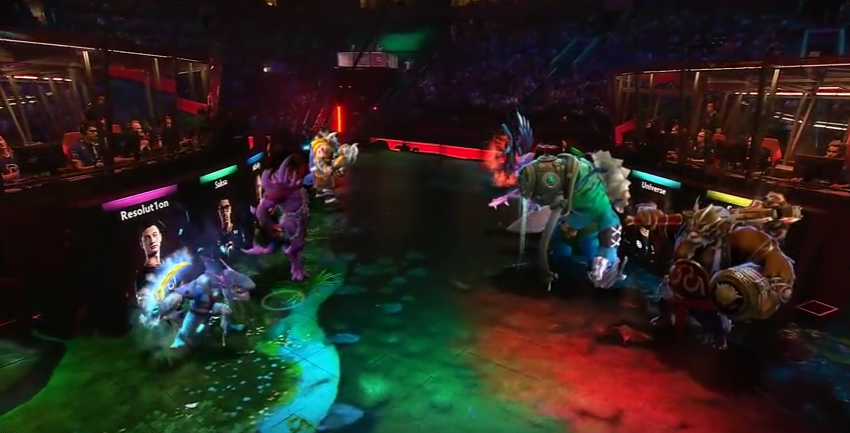
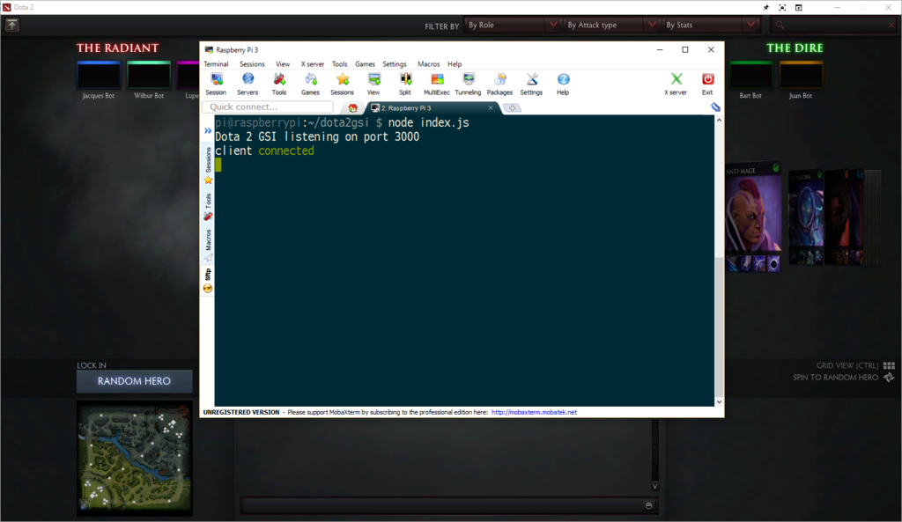

> [!NOTE]
> この記事は、過去に私が以下のURLで公開していた記事を文章の編集を行わずに掲載するものです。リンク切れとなったリンクの明記・Markdownパーサーのエラーを解消するために必要となったフォーマットの変更のみを行った状態で公開しています。
> 1. https://dota2yukidaruman.hatenablog.com/entry/lets-play-with-dota2-game-state-integration-what-is-gsi
> 2. https://dota2yukidaruman.hatenablog.com/entry/lets-play-with-dota2-game-state-integration-preparation
> 3. https://dota2yukidaruman.hatenablog.com/entry/lets-play-with-dota2-game-state-integration-built-spectating-helper

----

### #1 GSI (Game State Integration) について

Dota 2 Game State Integration(以下GSI)はゲーム中のデータを取得するための公式APIです。何ができるのかは、以下の実例を見ていただければ早いと思います。

#### 実例
主にLAN大会でのブースに使用されています。<br>
 (画像は[Dota 2 公式Youtubeチャンネルのキャプチャ](https://www.youtube.com/watch?v=EzloD-t_Adk))

Health・Manaと連動してLEDを点灯させている例です([Reddit](https://redd.it/5cqwgm))。<br>
[https://gfycat.com/FrankFatherlyEnglishsetter](https://gfycat.com/FrankFatherlyEnglishsetter (リンク切れ))

GSIで取得できるものの、ゲーム中のHUDには表示されていないGPM/XPMのデータをオーバーレイ表示している例です([GitHub Repository](https://github.com/moonrobin/Dota-2-GPM-Overlay))。([imgur](http://imgur.com/eZnoMxs))

対応するハードウェアを所有していれば、次のようなことも可能です(動画中では、Logitech G910, G410, Corsairのキーボードが使用されていて、キルストリークやアビリティに応じてキーを光らせています)。[YouTube](https://www.youtube.com/watch?v=KV-doX9VsXk)

これはCS:GOの事例ですが、爆弾と[Hue](http://www2.meethue.com/ja-jp/)(プログラマブルな照明)を連動させています。[YouTube](https://www.youtube.com/watch?v=QBdI54MHB-k)

#### Dota 2 GSIを扱うライブラリ
記事執筆時点でNode.jsとC#のライブラリがありました。他の言語で実装することも難しくはなさそうです。

- Node.js: [https://www.npmjs.com/package/dota2-gsi](https://www.npmjs.com/package/dota2-gsi)
- C#: [https://github.com/antonpup/Dota2GSI](https://github.com/antonpup/Dota2GSI)

#### その他
#### VACのリスク
存在しないと言えます。試合中にDota 2クライアントがGSI用のcfgファイルで指定されたポートにPOSTでデータを送り続けているだけだからです。試合中に利用できるデータはHUDに表示されているデータとXPM/GPMのデータに限られ、有利/不利が起きることはありません(ドキュメントには書かれていないが、観戦時には全プレイヤーのデータやRoshanのStatusのデータも利用できる)。しかしながら、利用は自己責任で行ってください。

#### CS:GOについての技術情報
GSIはCSGOにも対応しており、それについて[公式Wikiにドキュメントがある](https://developer.valvesoftware.com/wiki/Counter-Strike:_Global_Offensive_Game_State_Integration)ので、そちらをご参照ください。ドキュメントによれば、Dota 2のGSIでは不可能な他のプレイヤーの情報を得ることが可能なようです。

##### CS:GO向けの参考リンク
- Node.jsによる実装: [https://www.npmjs.com/package/node-csgo-gsi](https://www.npmjs.com/package/node-csgo-gsi)
- Pythonによる実装: [https://github.com/tsuriga/csgo-gsi-qsguide/blob/master/quickstartguide.py](https://github.com/tsuriga/csgo-gsi-qsguide/blob/master/quickstartguide.py)

#### Dota 2, CS:GO以外のゲームで同じことをやりたい
後述する[Aurora](https://github.com/antonpup/Aurora)でサポートされている20(記事執筆時点)のゲームでも、同様のことが技術的に可能です。

[Aurora x Rocket Leagueの例 (YouTube)](https://www.youtube.com/watch?v=XhXQt0LU520)

##### Auroraについて
とにかくゲーム内のアクションに応じてマウス/キーボードを光らせたい、または他のゲームについてどのように実装すれば良いのか知りたいという方は、[Aurora](https://github.com/antonpup/Aurora)プロジェクトを参照すると良いでしょう。

記事執筆時点で、20のゲームとLogitech, Razer, CorsairのRGBマウス/キーボードを光らせることができるようです。

----
GSIを使って何か作ってみた、という方がいらっしゃいましたら、ぜひコメント欄でお知らせください。

次の記事では、Dota 2 GSIを使って何かを作り始めるための準備について説明します。

----

### #2 準備編
この記事では、Node.jsと[dota2-gsi](https://www.npmjs.com/package/dota2-gsi)を使用することにしました。

#### 始めるために
前提として、[Node.js](https://nodejs.org/en/)とnpmがインストールされている必要があります。

1. `steamapps\common\dota 2 beta\game\dota\cfg\` に `gamestate_integration` フォルダを作り、そのフォルダ内に `gamestate_integration_*.cfg` ファイル(*は任意の名前で置き換える)を以下の内容で作成する。

       ```
       "dota2-gsi Configuration"
       {
           "uri"               "http://localhost:3000/"
           "timeout"           "5.0"
           "buffer"            "0.1"
           "throttle"          "0.1"
           "heartbeat"         "30.0"
           "data"
           {
               "provider"      "1"
               "map"           "1"
               "player"        "1"
               "hero"          "1"
               "abilities"     "1"
               "items"         "1"
           }
           "auth"
           {
               "token"         "hello1234"
           }
       }
       ```

    - 認証を必要としない場合 `"auth" { ... }` を削除する必要がある。
    - 認証を必要とする場合、**tokenを書き換えることを忘れないこと**
    - `"url"` はGSIデータを受信するサーバーのアドレスで、異なるマシンでもリモートネットワーク上のマシンでも良い(Raspberry Piで動作確認済み)

2. `npm install dota2-gsi`で必要なライブラリをインストールする
3. (任意) 動作を確認する。以下のスクリプトでGSIを受信するサーバーを実行し、Demo heroを開始し、`client connected`と表示されれば、正常に動作していることが確認できる

       ```js
       "use strict"

       let d2gsi = require('dota2-gsi');
       let server = new d2gsi({
           // uncomment and modify if you use any port other than 3000
           // port: 3000,
           // uncomment and modify if you use token(s) and authentication
           // tokens: 'hello1234'
       });

       server.events.on('newclient', function(client) {
           console.log('client connected');
       });
       ```

    - Raspberry Piを用いて動作確認をした例:<br>

#### 注意事項
- cfgファイルを書き換えた場合、変更を反映するには再起動する必要がある。

---

### #3 実際に製作する

何を作るかに悩んだ末、観戦を助けるツールを作ってみることにしました。実際に動いている様子:  
<video src="./static/archive/spectating-helper-demo.mp4" controls></video>

映像は映像はBorderless WindowにしてあるDotaクライアントを[SkyWay ScreenShare](https://html5experts.jp/yusuke-naka/16445/)でキャプチャーしたもの、音声はPlay sound in DesktopでDotaから出力されたものをそのまま聞く形で利用しています。

#### 便利な点
- ブラウザのウィンドウで観戦ができる(リサイズなどが便利)
- プレイヤーのDotabuff/Opendotaページをすぐに開ける
- 全員のアイテムやBuyback statusを同時に表示できる

#### 観戦時のGSIデータについて
- 観戦・リプレイ・Broadcastで同じデータ構造のデータが送られてくる
- 建造物、ヒーローの座標、Roshanのリスポーン時間などのデータは取得できない
  - roshan_stateはalive, respawn_base, respawn_variableの3種類なのでrespawn_baseの段階ではリスポーンまでの残り時間を計算することができない
  - これらのデータは大会の試合であればWeb APIの[GetLiveLeagueGames](https://wiki.teamfortress.com/wiki/WebAPI/GetLiveLeagueGames)を使用して取得できる。更新頻度は20秒に1度

#### データ形式
[生データ (リンク切れ)](https://jsonblob.com/58313df2e4b0a828bd27ae96)

<details>
<summary>GSIのデータ形式詳細</summary>

```json
{
    "provider": {
        "name": "Dota 2",
        "appid": 570,
        "version": 44,
        "timestamp": 1479620832
    },
    "map": {
        "name": "dota",
        "matchid": 2790650572,
        "game_time": 2177,
        "clock_time": 1450,
        "daytime": true,
        "nightstalker_night": false,
        "game_state": "DOTA_GAMERULES_STATE_GAME_IN_PROGRESS",
        "win_team": "none",
        "customgamename": "",
        "radiant_ward_purchase_cooldown": 0,
        "dire_ward_purchase_cooldown": 0,
        "roshan_state": "respawn_base",
        "roshan_state_end_seconds": 88
    },
    "player": {
        "team2": {
            "player0": {
                "steamid": "76561198091503033",
                "name": "!",
                "activity": "playing",
                "kills": 0,
                "deaths": 3,
                "assists": 2,
                "last_hits": 55,
                "denies": 5,
                "kill_streak": 0,
                "team_name": "radiant",
                "gold": 125,
                "gold_reliable": 35,
                "gold_unreliable": 90,
                "gpm": 242,
                "xpm": 255,
                "net_worth": 3760,
                "hero_damage": 2898,
                "support_gold_spent": 1240,
                "wards_purchased": 14,
                "wards_placed": 4,
                "wards_destroyed": 2,
                "runes_activated": 1,
                "camps_stacked": 0
            }, ...
        },
        "team3": { ... }
    },
    "hero": {
        "team2": {
            "player0": {
                "id": 64,
                "name": "npc_dota_hero_jakiro",
                "level": 11,
                "alive": true,
                "respawn_seconds": 0,
                "buyback_cost": 643,
                "buyback_cooldown": 0,
                "health": 1160,
                "max_health": 1160,
                "health_percent": 100,
                "mana": 972,
                "max_mana": 972,
                "mana_percent": 100,
                "silenced": false,
                "stunned": false,
                "disarmed": false,
                "magicimmune": false,
                "hexed": false,
                "muted": false,
                "break": false,
                "has_debuff": false,
                "selected_unit": false
            },
        },
        "team3": { ... }
    },
    "abilities": {
        "team2": {
            "player0": {
                "ability0": {
                    "name": "jakiro_dual_breath",
                    "level": 2,
                    "can_cast": true,
                    "passive": false,
                    "ability_active": true,
                    "cooldown": 0,
                    "ultimate": false
                },
                ...,
                "attributes": {
                    "level": 0
                }
            },
            "player1": {
                "ability0": {
                    "name": "ember_spirit_searing_chains",
                    "level": 4,
                    "can_cast": true,
                    "passive": false,
                    "ability_active": true,
                    "cooldown": 0,
                    "ultimate": false
                }, ...
            }, ...

        },
        "team3": { ... }
    },
    "items": {
        "team2": {
            "player0": {
                "slot0": {
                    "name": "item_arcane_boots",
                    "can_cast": false,
                    "cooldown": 37,
                    "passive": false
                },
                ...,
                "stash0": {
                    "name": "empty"
                },
                ...
            }, ...
        },
        "team3": { ... }
    }
}
```
</details>

#### ソースコード
[https://github.com/yukidaruma/dota2-spectating-helper](https://github.com/yukidaruma/dota2-spectating-helper)

インストールは[readme](https://github.com/yukidaruma/dota2-spectating-helper/blob/master/readme.md)を参照してください。問題を発見された場合、コメントまたは[Issues](https://github.com/yukidaruma/dota2-spectating-helper/issues)でお知らせください。
