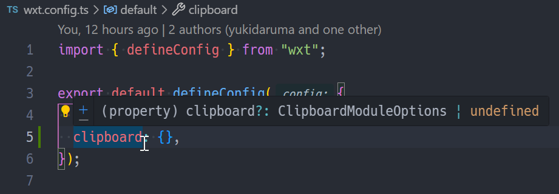

### 動機

前回の記事で紹介した [View in Markdown](./created-view-in-markdown-chrome-extension.md) Chrome 拡張機能に、新しいタブで開く代わりに Markdown コンテンツをクリップボードにコピーする機能を追加したいと考えました。このクリップボードへの書き込み機能の実装は、当初想定していたよりも複雑となることがわかりました。

具体的には、 `manifest.json` で `clipboardWrite` 権限を要求していてもタブにフォーカスがないと `navigator.clipboard.writeText` が使えないこと、また、Background Script からは Clipboard API を直接使えないという制約があるためです ([GoogleChrome/chrome-extensions-samples@11898ee](https://github.com/GoogleChrome/chrome-extensions-samples/tree/11898ee8ebbb9ac5ec72408754ef19a05ac93341/functional-samples/cookbook.offscreen-clipboard-write#readme))。これらの問題を回避するには Offscreen Document を使用する必要があり、実装が少し複雑になります。

そこで、このクリップボード書き込み処理を View in Markdown 拡張機能のコア機能として組み込むのではなく、他の拡張機能でも再利用できるよう、 WXT のモジュール機構を利用した独立したパッケージとして作成することにしました。

### WXT モジュールの作り方

NOTE: 以後の説明では、 [bun](https://bun.com/) を JavaScript Runtime / Package Manager / Bundler に使用しています。

WXT のモジュール機構の詳細については [WXT Modules](https://wxt.dev/guide/essentials/wxt-modules.html) (公式ドキュメント) を、モジュールの実装例については [wxt-dev/wxt/packages@fad5ab6](https://github.com/wxt-dev/wxt/tree/fad5ab6c4457381179ed0adb52927bceb45d7f62/packages) をご参照ください。  
また、作成した `wxt-module-clipboard` のソースコードやドキュメンテーションは [yukidaruma/wxt-module-clipboard](https://github.com/yukidaruma/wxt-module-clipboard) (GitHub) をご参照ください。

このセクションでは、 WXT モジュールを作成するうえでわかりにくい点について説明します。

#### client bundle でのみ利用されるコードを分割する

`wxt` (フレームワーク本体) のコードはブラウザから直接 `import` される前提で書かれたものではありません。モジュールを定義する (`defineWxtModule` を呼び出す) コードをブラウザで利用するコードから `import` すると、 bundle size が増大してしまったり、ビルドエラーが発生したりします。この問題を避けるため、クライアント側でのみ使用するコードは専用の entrypoint (`wxt-module-clipboard/client`) から `import` できるようにしました。

```ts
// wxt-module-clipboard/index.ts
import "wxt";
import { addWxtPlugin, defineWxtModule } from "wxt/modules";

export default defineWxtModule<ClipboardModuleOptions>({
  // ...
});
```

```ts
// wxt-module-clipboard/client.ts
export async function copyToClipboard() {}
export async function copyToClipboardViaOffscreen() {}
```

```ts
// モジュールの機能を利用するコード
import { copyToClipboard } from "wxt-module-clipboard/client";
```

#### 特定の entrypoint だけで実行されるスクリプトを作成する

WXT には `entrypoints/` 以下に作成した特定のファイル名のファイルが実行ファイルとなる [entrypoint](https://wxt.dev/guide/essentials/entrypoints.html) と呼ばれる仕組みがあります。

モジュールから entrypoint にスクリプトを挿入するには `addWxtPlugin` を使用します。

```ts
// wxt-module-clipboard/index.ts
import "wxt";
import { addWxtPlugin, defineWxtModule } from "wxt/modules";

export default defineWxtModule<ClipboardModuleOptions>({
  setup(wxt, options) {
    const pluginModuleId = "wxt-module-clipboard/background-plugin";
    addWxtPlugin(wxt, pluginModuleId);
  },
})
```

ただし、このままだとすべての entrypoint にスクリプトが挿入されてしまいます。例えば `chrome.runtime.onMessage.addListener` を利用してメッセージのリスナを登録するコードの場合、同じリスナが複数のコンテキストで登録される問題が生じます。

そこで、特定の entrypoint でのみ必要となるスクリプトについては、 `import.meta.env.ENTRYPOINT` を使用した条件分岐を追加し、その entrypoint でのみ実行されるようにします。この条件分岐は Bundler の静的解析による Tree-shaking / Dead Code Elimination の対象となり、スクリプトを必要としない entrypoint からコードを完全に削除することができます。

```ts
// modules/background-plugin.ts
import { setupClipboard } from "./client";

export default () => {
  if (import.meta.env.ENTRYPOINT !== "background") return;

  setupClipboard();
};
```

#### モジュールにオプションを追加する

一般的なプラグインシステム (例: [Vite の plugin](https://vite.dev/guide/api-plugin.html)) では `plugins: [somePlugin(config)]` の形 (オブジェクト) によりプラグインを追加するため、インラインで設定を行うことができます。一方、 WXT のモジュール機構は `modules: ["some-module"]` の形で名前を渡すことで読み込むため、モジュールを設定可能にする方法が異なっています。

WXT の設定ファイルでモジュールのオプションを設定できるようにするには、 TypeScript の [Module Augmentation](https://www.typescriptlang.org/docs/handbook/declaration-merging.html#module-augmentation) 機能を利用して WXT の `InlineConfig` 型の定義を拡張します。

```ts
// wxt-module-clipboard/index.ts
declare module "wxt" {
  export interface InlineConfig {
    clipboard?: {
      optionalPermissions?: boolean;
    };
  }
}

export default defineWxtModule<ClipboardModuleOptions>({
  configKey: "clipboard", // <-- 型定義と一致する必要がある
  setup(wxt, options) {
    // options でユーザーが設定した値にアクセス可能
    const useOptionalPermissions = options?.optionalPermissions ?? false;
    // ...
  },
});
```

これにより、ユーザーは WXT の設定ファイルでモジュールのオプションを指定できるようになります。

```ts
// wxt.config.ts
export default defineConfig({
  modules: ["wxt-module-clipboard"],
  clipboard: {
    optionalPermissions: true,
  },
});
```

<figure>
  
  <figcaption>WXT の <code>defineConfig</code> でモジュールのオプションを利用する例</figcaption>
</figure>

#### その他

- `wxt-dev/wxt` リポジトリ内のパッケージではビルドコマンドに [`buildc`](https://www.npmjs.com/package/@aklinker1/buildc) を使用しています。このツールは monorepo を対象としたものであるため、単一のモジュールである `wxt-module-clipboard` の開発には使用しませんでした。
- モジュール開発時は、 `example/` フォルダに `file:../` 形式でインストールしたモジュールを利用するサンプルコードを作成し、モジュール本体と両方を `bun dev` で watch した状態で開発を行うことをおすすめします。
- [`webextension-polyfill`](https://github.com/mozilla/webextension-polyfill) を使用すべきか - `browser` vs `chrome`:
  - `webextension-polyfill` は Chrome 拡張で、 Web 標準で規定された `browser.*` 以下の名前空間で拡張機能用の API を利用できるようにする polyfill です。
  - Offscreen Document API は標準化された API ではなく ([w3c/webextensions#170](https://github.com/w3c/webextensions/issues/170))、 Web 標準との互換性を重視する Firefox ではこの機能が未実装となっています。したがって、 `wxt-module-clipboard` は `webextension-polyfill` を利用しても Firefox で動作しませんでした。
  - `webextension-polyfill` を利用しても entrypoint ごとにファイルサイズが約 9KB 増加するだけの結果となることがわかったため、 `wxt-module-clipboard` では `webextension-polyfill` を利用せず、 Firefox に対応していないことを README に明記することにしました。
  - なお、 WXT を利用した拡張機能では、 `webextension-polyfill` を直接 `import` する代わりに `wxt/browser` が `export` する `browser` を使用することになっています。

### npm に公開する

汎用的な形でモジュールを作成することに成功したため、作成したパッケージを npm に公開することにしました ([`wxt-module-clipboard` on npm](https://www.npmjs.com/package/wxt-module-clipboard))。 [npmjs.com](https://www.npmjs.com/) の Access Tokens ページでトークンを作成後、 `npm publish` の代わりに [`bun publish`](https://bun.com/docs/pm/cli/publish) を使用して npm にビルドしたパッケージをアップロードしています。

```bash
bun run build
NPM_CONFIG_TOKEN=npm_xxxx bun publish
```

`bun publish` の完了後に `yukidaruma/wxt-module-clipboard` リポジトリを clone して動作確認を行いました。 `example/` フォルダ内で、 `npm i`, `npm run dev` / `bun i`, `bun dev` を利用して、ビルドした拡張機能がそれぞれ正常に動作することを確認しています。

### あとがき

今回作成した `wxt-module-clipboard` を利用すれば、 Chrome 拡張におけるクリップボードへの書き込みを簡単に実装できるようになります。拡張機能を開発していて、クリップボードへの書き込みを実装する機会があればぜひご利用ください。また、今回の記事が WXT モジュール機構の理解や WXT モジュールの開発の一助となれば幸いです。

現時点では Chrome のみにしか対応していませんが、 WXT の [`import.meta.env.FIREFOX`](https://wxt.dev/guide/essentials/target-different-browsers.html#target-a-browser) を利用することで、単一のコードベースで Firefox にも対応できるかもしれません。 Firefox への対応については、将来の課題としています ([yukidaruma/wxt-module-clipboard#1](https://github.com/yukidaruma/wxt-module-clipboard/issues/1))。

### 参考文献

- [Manifest V2 - Permissions with warnings](https://developer.chrome.com/docs/extensions/mv2/permission-warnings#permissions_with_warnings) - Chrome Extension API Reference (注意: MV2 について、最終更新日が2012年)
- [Chrome拡張でbackgroundからコピーをする方法とChrome拡張のセキュリティについて](https://qiita.com/kusano_k/items/d459b738e3ebf038c645) - Qiita
- [`chrome.offscreen`](https://developer.chrome.com/docs/extensions/reference/api/offscreen) - Chrome Extension API Reference
- [Offscreen Document を利用して文字列をコピーするサンプルコード](https://github.com/GoogleChrome/chrome-extensions-samples/tree/11898ee8ebbb9ac5ec72408754ef19a05ac93341/functional-samples/cookbook.offscreen-clipboard-write) - Google 公式サンプルコード (GitHub)
